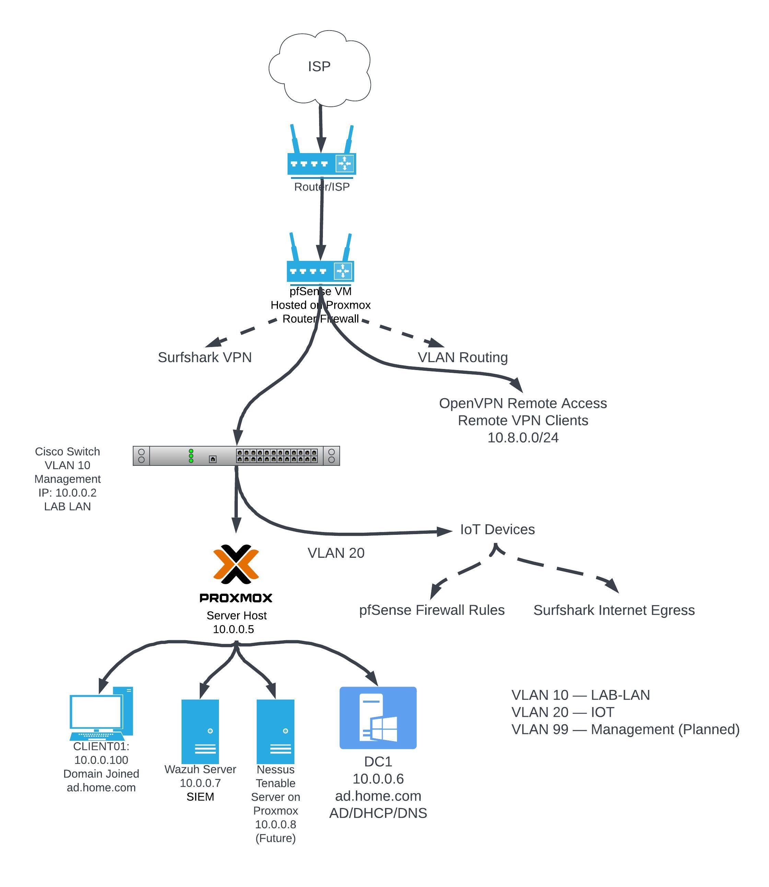

# Enterprise Cybersecurity Home Lab

## Overview

This project documents the design, deployment, security, and administration of my personal enterprise-style cybersecurity home lab.

The environment was built to provide hands-on experience with technologies commonly found in business networks, including virtualization, Active Directory, network segmentation, firewalls, VPNs, centralized logging, SIEM monitoring, and security detection engineering.

Rather than building isolated virtual machines, the goal was to create an interconnected environment that behaves more like a small enterprise network.

## Technologies Used

* **Proxmox VE** — Virtualization platform
* **pfSense** — Firewall, routing, VPN, and network segmentation
* **Cisco Catalyst Switch** — Layer 2 switching and VLAN configuration
* **Windows Server 2025** — Active Directory Domain Services, DNS, DHCP, and Group Policy
* **Windows 11** — Domain-joined client workstation
* **Ubuntu Linux** — Linux administration and testing
* **Wazuh** — SIEM, endpoint monitoring, and custom security detections
* **OpenVPN** — Secure remote access
* **Surfshark OpenVPN** — Privacy-focused outbound VPN routing

---

# Network Architecture

## Logical Network Architecture



The primary lab network uses:

```text
10.0.0.0/24
```

Core infrastructure includes:

| System    | Role                          | IP Address |
| --------- | ----------------------------- | ---------- |
| pfSense   | Router / Firewall             | 10.0.0.1   |
| Cisco SW1 | Managed Switch                | 10.0.0.2   |
| Proxmox   | Hypervisor                    | 10.0.0.5   |
| DC1       | Active Directory / DNS / DHCP | 10.0.0.6   |
| Wazuh01   | SIEM                          | 10.0.0.7   |
| Jump PC   | Administrative Workstation    | 10.0.0.101 |

Additional clients receive addressing through DHCP.

---

# VLAN Architecture

Network segmentation was implemented using VLANs.

| VLAN    | Name       | Purpose                    |
| ------- | ---------- | -------------------------- |
| VLAN 10 | LAB-LAN    | Primary lab infrastructure |
| VLAN 20 | IOT        | IoT and smart devices      |
| VLAN 99 | Management | Planned infrastructure management network |
| VLAN 1  | Default    | Limited/unused             |

A trunk between the Cisco switch and Proxmox carries the required VLANs to pfSense and virtualized infrastructure.

This allows firewall policies to control communication between different network segments.

---

# Virtualization

The core virtual infrastructure is hosted on **Proxmox VE**.

Proxmox hosts several critical systems including:

* pfSense
* Windows Server domain infrastructure
* Windows client systems
* Wazuh SIEM
* Linux systems

Snapshots and backups are taken before major configuration changes to provide recovery points during testing and upgrades.

---

# Active Directory

A Windows Server 2025 domain controller was deployed to provide centralized identity and network services.

Domain:

```text
ad.home.com
```

NetBIOS domain:

```text
HOMELAB
```

Implemented services include:

* Active Directory Domain Services
* DNS
* DHCP
* Organizational Units
* Domain user accounts
* Administrative accounts
* Group Policy
* Windows security auditing
* Network file shares

Example OU structure:

```text
HomeLab
├── Users
└── Admins
```

Windows clients were joined to the domain and tested for authentication, Group Policy application, DNS resolution, RDP access, and file share access.

---

# Group Policy & Windows Security

Several enterprise-style security policies were configured and tested through Group Policy.

Examples include:

* Password policies
* Account lockout policies
* Windows Defender configuration
* Windows Update policies
* Security auditing
* Process creation auditing
* Remote Desktop configuration

Windows Event ID **4688** process creation auditing was enabled to provide additional visibility for SIEM monitoring.

---

# pfSense Firewall

pfSense serves as the primary security gateway for the environment.

Responsibilities include:

* Internet routing
* Network Address Translation
* Firewall policies
* Inter-VLAN routing
* DNS forwarding/resolution
* VPN services
* Policy-based routing

Firewall rules are used to control communication between trusted infrastructure, IoT devices, remote VPN clients, and the Internet.

---

# Remote Access VPN

An OpenVPN remote-access environment was configured to securely access the home lab remotely.

Remote VPN clients can access internal resources such as:

```text
10.0.0.0/24
```

This provides secure remote administration of systems including:

* Proxmox
* pfSense
* Windows Server
* Wazuh
* Linux systems

---

# Outbound VPN Routing

A separate VPN connection was configured through pfSense using Surfshark.

Selected network traffic can be policy-routed through the VPN instead of directly through the ISP.

Testing was performed using public IP verification and routing tests to confirm that client traffic exited through the VPN tunnel.

---

# Wazuh SIEM

Wazuh was deployed as the centralized SIEM platform.

The deployment includes:

* Wazuh Manager
* Wazuh Indexer
* Wazuh Dashboard
* Filebeat

Windows endpoints including the domain controller and Windows client were enrolled as Wazuh agents.

The SIEM collects Windows security telemetry for monitoring and detection.

---

# Detection Engineering

One of the primary security objectives of the lab is learning how security telemetry becomes actionable detections.

Windows auditing generates events such as:

```text
4688 - Process Creation
4720 - User Account Created
```

These events are forwarded to Wazuh for analysis.

Custom Wazuh detection rules are also being developed to identify suspicious command-line activity.

This portion of the project provides hands-on experience with:

* Windows Event Logs
* SIEM rule development
* Regular expressions
* Command-line telemetry
* Detection testing
* False-positive reduction
* Security monitoring

---

# Troubleshooting & Incident Recovery

An important part of this project has been troubleshooting real infrastructure failures rather than only documenting successful configurations.

Issues encountered include:

* DNS outages
* Incorrect routing
* VLAN connectivity problems
* VPN routing failures
* Firewall misconfigurations
* Proxmox networking problems
* Virtual machine startup failures
* Power outage recovery
* pfSense configuration problems
* Wazuh custom-rule errors
* Proxmox VE upgrades

Each issue required identifying the affected network layer, testing connectivity, isolating the failure, and validating the final solution.

These troubleshooting scenarios significantly improved my understanding of how interconnected enterprise infrastructure behaves during failures.

---

# Skills Demonstrated

This project demonstrates hands-on experience with:

### Networking

* TCP/IP
* Routing
* VLANs
* 802.1Q trunking
* Cisco IOS
* DNS
* DHCP
* NAT
* Network troubleshooting

### Systems Administration

* Windows Server 2025
* Active Directory
* Group Policy
* Windows administration
* Linux administration
* Proxmox virtualization

### Cybersecurity

* Firewall administration
* Network segmentation
* VPN architecture
* SIEM deployment
* Centralized logging
* Windows security auditing
* Detection engineering
* Security monitoring

### Troubleshooting

* Packet-flow analysis
* DNS troubleshooting
* Routing troubleshooting
* Firewall rule analysis
* Service troubleshooting
* Infrastructure recovery

---

# Current Project Status

The home lab continues to evolve as additional security controls, monitoring capabilities, and attack simulations are implemented.

Upcoming work includes:

* Expanding custom Wazuh detection rules
* Testing additional Windows attack techniques
* Improving VLAN segmentation
* Expanding IoT isolation
* Building security dashboards
* Creating additional detection scenarios
* Documenting attack and detection workflows

---

## Project Goal

The ultimate goal of this project is to continuously build, secure, attack, monitor, troubleshoot, and improve an enterprise-style environment while developing practical skills in:

**IT Infrastructure | Networking | Systems Administration | Cybersecurity | SIEM | Detection Engineering**
